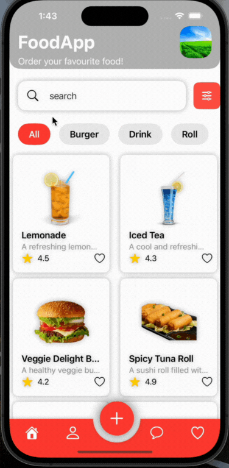
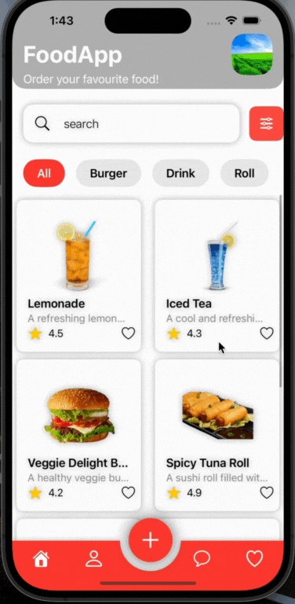
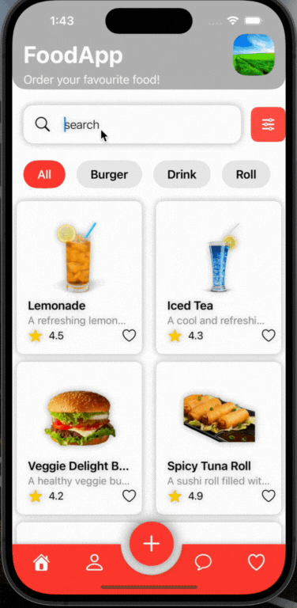
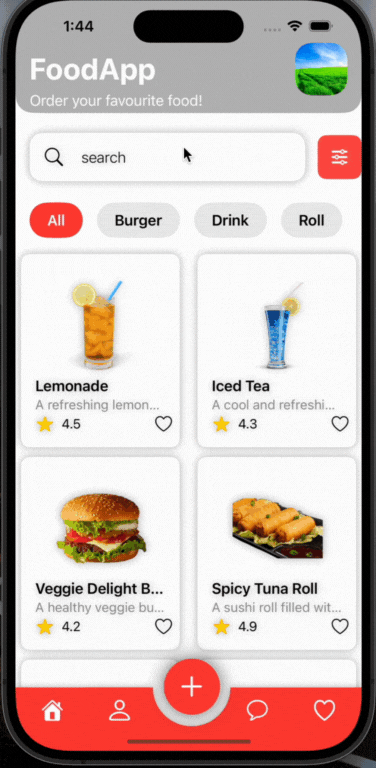
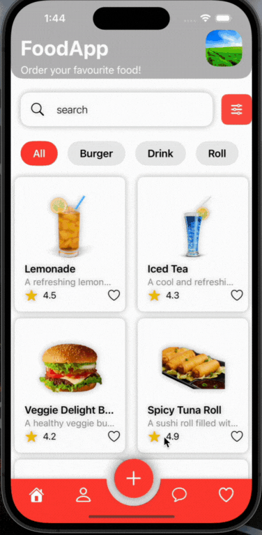
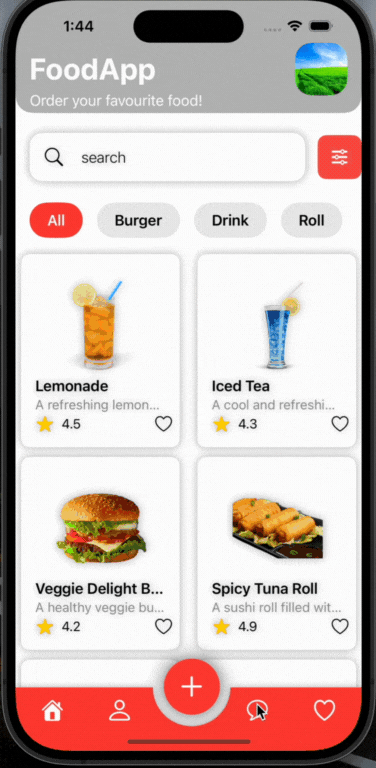

# FoodApp
---

FoodApp is a mobile application designed to provide users with an easy and interactive way to order their favorite food. This README file details the functionalities of the app, supported views, and their uses. **Please note that all the data used in this app is mock data, and it operates entirely offline. As it is currently designed, the app does not support sending messages through the internet. However, its message model and UI are fully developed and functional, making it a useful reference for other developers building similar applications.** 

## Key Features

- **Home View**: Display a variety of food items categorized for easy browsing.
- **Search View**: Allows users to search for specific food items.
- **Favorite View**: Users can mark their favorite items for quick access.
- **Detail View**: Provides detailed information about each food item.
- **Profile View**: User profile management.
- **Add View**: Specifically designed for adding burger items.
- **Message View**: Fully developed messaging interface, though currently offline.

### Functionality Explanation with GIF Demonstrations

#### 1. Home View

**Functionality:**
- Displays a variety of food items including categories such as Burger, Drink, and Roll.
- Allows users to browse through the items.
- Features horizontal and vertical scroll views for easy navigation.
- Users can see the brief descriptions of each item.

#### 2. Search View

**Functionality:**
- Provides a search bar for users to find specific food items.
- Users can filter items by categories such as All, Burger, Drink, and Roll.
- Displays search results dynamically based on user input.
- The search bar is placed at the top of the screen.

#### 3. Favorite View

**Functionality:**
- Users can mark their favorite items by tapping the heart icon.
- This view lists all items marked as favorites for quick access.
- Favorites can be managed by toggling the heart icon.
- This feature helps users to easily access their preferred items later.

#### 4. Detail View

**Functionality:**
- Displays detailed information about the selected food item.
- Includes item description and it's price.
- Users can see larger images of the food item.

#### 5. Profile View

**Functionality:**
- Shows user profile information including name, email, and profile picture.
- Users can manage their profile settings from this view.

#### 6. Add View

**Functionality:**
- Allows users to modify existing items, particularly burgers.
- Lists possible ingredients (e.g., toppings, Slide) that can be added to the 
  burger.
- Shows visual representation of each ingredient.
- Displays the name and additional cost of each ingredient.
- Features toggle buttons to add or remove ingredients.

#### 7. Message View

**Functionality:**
- Fully developed messaging interface for communication within the app.
- Supports sending messages.
- Currently, operates offline and does not support internet-based messaging.

---

## Notes

- **Offline Data**: The app uses mock data and works completely offline.
- **Scroll Views**: Multiple scroll views are used for smooth navigation.
- **Add Function**: Currently, the add function is only implemented for burger 
    items.

This app can be a valuable reference for developers looking to build similar food ordering applications, providing a well-designed UI and a variety of features.

*Note: I have not uploaded the entire project to GitHub for security reasons. If you need my project urgently, please email me at mehediakbar9@gmail.com.*

---

